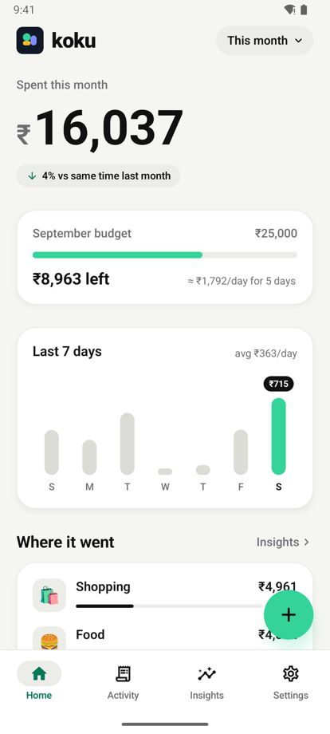
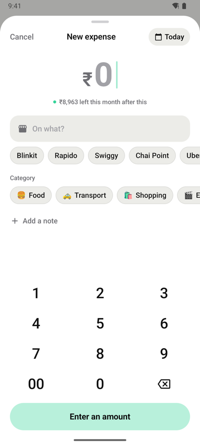
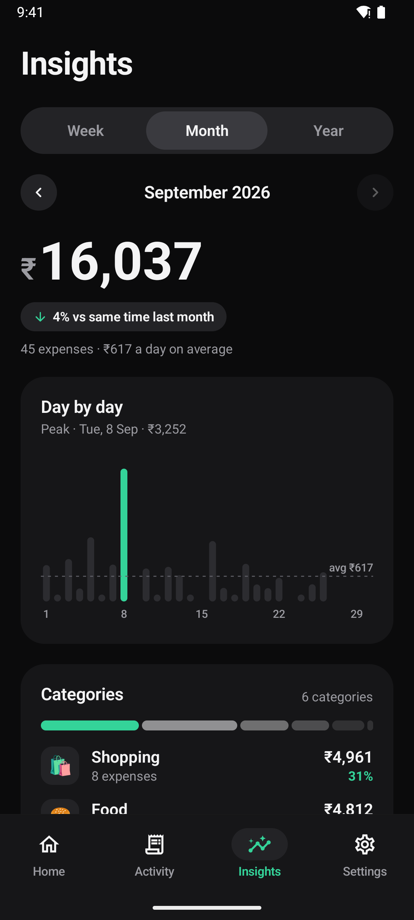

<p align="center">
  
</p>

<h1 align="center">Koku for Android</h1>

<p align="center">
  A calm, minimalist expense tracker for Android where logging a purchase takes about five seconds:<br>
  <b>tap a tile or use your phone's gesture → type what it was → type the amount → pick a category.</b> Done.
</p>

<p align="center">
  Kotlin · Jetpack Compose · Room · Compose Canvas charts · ViewModels · JUnit · Android 8.0+ · only Google's Jetpack libraries
</p>

<p align="center">
  Also on iPhone, where a double-tap on the back of the phone does the same:
  <a href="https://github.com/Madhav0637/bughet-app-ios"><b>Koku for iOS</b></a>.
</p>

<p align="center">
  
  
  
</p>

## Why

Most expense trackers don't fail because they lack features. They fail because opening an app, finding the add button and filling in a form is just enough friction that people stop logging after a week.

Koku puts entry one gesture away. No hardware gesture exists on every Android phone, and apps can't listen to the power button, so the quick-entry pop-up can be opened three ways:

- a **Quick Settings tile** (swipe down, tap "Log Expense"), which works on every phone
- a **home-screen shortcut** (long-press the Koku icon, or pin a "Log Expense" icon), which also works on every phone
- the phone's **own gesture**, such as Samsung's side-button double press or Pixel's Quick Tap, set to open the "Log Expense" entry

The pop-up is the app's own see-through window, drawn over whatever you're doing. It asks three questions and saves without ever opening the main app. When you do open the app, it stays quiet: one big number per screen, a neutral canvas, and a single highlight colour for the thing that matters.

## Features

- **Quick entry from anywhere.** "On what?" → amount (number pad) → category, most-used first. Saved silently, in about five seconds. Both text steps use the same big, bold box.
- **Home.** What you've spent this week, month or year (the choice is remembered), compared with the same point last time ("↓ 12% vs same time last month"), your monthly budget, the last 7 days as a mini chart, the top three categories and the latest expenses.
- **Monthly budget.** A progress bar, what's left (or how much you're over), and roughly what you can spend each day for the rest of the month. Alerts when you pass 80% and again at 100%, each sent at most once a month: a banner inside the app, or a notification when you logged from the quick-entry pop-up.
- **Insights.** Week, month or year, now or any time before (tap the arrows or swipe the total). A day-by-day (or month-by-month) bar chart with the peak highlighted and a dashed average line; tap or drag across it for a bar's total. Categories with their share, biggest spend, most visited merchant, average per day, no-spend days 🎉 and the top five merchants.
- **A faster Add screen.** Amount first on a custom keypad (hold delete to clear). Merchants you've used before appear as one-tap suggestions, and choosing one fills in the category you used last time. Optional note, and any date and time, not just now. The save button says what's missing until it reads "Save ₹420". Editing uses the same screen, with a delete button and Undo.
- **Activity.** Every expense grouped by day with each day's total. Search by merchant (ignores case and accents), filter with category chips, swipe to delete with **Undo**, tap to edit.
- **Light, Dark or System**, cross-fading between them, and a choice of six highlight colours (mint, lime, sky, periwinkle, coral, amber). Dialogs, date pickers and the quick-entry pop-up follow the theme too.
- **Categories.** Seven defaults, each with an emoji. Add your own, rename them, and move all of a category's expenses elsewhere. Every list shows the most-used categories first. A category can't be deleted while it's in use or if it's the last one.
- **Export.** A **CSV** spreadsheet (now with notes) for Excel or Google Sheets, or an A4 **PDF** report with totals, a category breakdown and a paginated table of every expense, shared as a real file.
- **Set up quick entry.** A guide in Settings with one-tap buttons to add the tile and pin a home-screen icon, and where to find the gesture setting on Samsung and Pixel phones.
- **Private by design.** Everything stays on the phone. No account, no server, no network access.
- **Indian rupees**, with Indian digit grouping (₹1,23,456).

## How quick entry works

```
Quick Settings tile ──────────┐
Long-press shortcut ──────────┼─▶ QuickEntryActivity (see-through window over the current app)
"Log Expense" launcher entry ─┘      ├─ "On what?"   big text box
  (brand gestures open this)         ├─ "Amount (₹)" same big box, number pad
                                     ├─ category list, most-used first
                                     ├─▶ ExpenseService.add(...) → Room database on the phone
                                     └─▶ BudgetService: crossed 80% or 100% this month? → one notification
```

The pop-up has its own empty task affinity and is excluded from Recents, so saving or cancelling returns you straight to what you were doing. From the lock screen, the tile asks you to unlock first. The save is silent; the only exception is the budget notification, sent at most twice a month. On Android 13 and newer, Koku asks for notification permission when you turn budget alerts on.

## Design

The Koku redesign was first built for iPhone. The Android app uses the same design language, built natively in Jetpack Compose and following Android's conventions where they differ:

- **One hero number per screen.** Totals are large and roll between values; everything else is quieter.
- **Neutral canvas, one highlight.** Off-white (or near-black) surfaces, graphite text, and one highlight colour used only for the add button, progress, selection and the chart's key bar. Category emoji supply the rest of the colour, so charts stay monochrome.
- **Charts drawn with Compose Canvas.** No chart library: the Insights bars, axis labels and dashed average line are drawn directly, with tap and drag to pick a bar and a spoken summary for TalkBack. Home's 7-day chart is built from plain Compose shapes.
- **Motion with a purpose.** Buttons that shrink with a spring instead of a ripple, a sliding segmented control, bars that grow in, numbers that roll, a checkmark on save and haptics on every key. Grow-in animations are skipped when Android's "Remove animations" setting is on.
- **The theme reaches everything.** Material dialogs, date and time pickers, the status and navigation bars and the quick-entry pop-up all follow Light / Dark / System. On Android 12 and newer the choice is also handed to the system as the app's night mode.
- **System font with tabular figures,** so amounts don't shift sideways as they change.

## Architecture

```
Tile / shortcut / gesture → quick-entry pop-up ──┐
                                                 ├──→ Services ──→ Room (on the phone)
Compose screens → ViewModels ────────────────────┘       │
Compose screens ◀── ViewModels ◀── Flow ─────────────────┘   (read-only, refreshes by itself)

AppSettings (SharedPreferences): theme, highlight, periods, budget, last alert sent
```

- **Every write goes through a service** (`ExpenseService`, `CategoryService`), so the pop-up and the screens share one set of rules, for example "amount must be more than ₹0" and "category names are unique regardless of case". An invalid edit changes nothing. `BudgetService` wraps a save to find out whether it crossed 80% or 100% of this month's budget.
- **Screens follow Android's standard pattern:** Room queries return `Flow`s, and ViewModels combine them into screen state, so lists update by themselves when the pop-up saves an expense.
- **Settings live in one `AppSettings`** backed by `SharedPreferences`, with each setting exposed as a `StateFlow`. The app and the pop-up run in the same process and share it, so the budget and the record of which alerts were sent are the same for both.
- **The rules and calculations are plain Kotlin** with no Android code: `PeriodCalculator` (Monday-start weeks, earlier periods, "same point last month"), `SpendingSummary`, `PeriodInsights` and `PeriodComparison`, `BudgetPace` and `BudgetAlerts`, `MerchantSuggestions`, `KeypadInput`, `HistoryFilter`, `CsvExporter`, `CategoryRules` and the PDF's `ReportContent`. They're tested on the JVM in seconds.
- **Deleting a category that's in use is refused twice:** by the service, and by a `RESTRICT` foreign key in the database itself.
- **Default categories are seeded when the database file is created**, so the pop-up always has categories, even if the main app was never opened.

<details>
<summary><b>Project structure</b></summary>

```
app/src/main/java/com/madhav0637/budgetapp/
├── data/            # Room entities, DAOs, database and migrations, AppSettings
├── domain/          # Services and plain-Kotlin rules: periods, summary, insights, budget, merchant
│                    # suggestions, keypad, filter, CSV, report content, formatting
├── export/          # CSV/PDF file writer, PDF renderer
├── notifications/   # BudgetNotifier: budget alerts after a quick-entry save
├── tile/            # Quick Settings tile
└── ui/
    ├── theme/       # Koku colours, Light / Dark / System, highlight colours, type
    ├── components/  # Cards, chips, segmented control, keypad, toasts, logo, the expense row
    ├── home/  activity/  insights/   # the three main tabs (the Insights chart draws on a Canvas)
    ├── expenseform/ # Add / Edit, date and time dialog
    ├── budget/      # Monthly budget sheet
    ├── quickentry/  # The pop-up
    └── settings/    # Settings, Categories, Export, quick-entry guide
app/src/debug/         # Sample data and launch options for screenshots (debug builds only)
app/src/release/       # The release stand-in: no sample data, launch options ignored
app/src/test/          # JVM tests for the domain layer and the Insights titles
app/src/androidTest/   # On-device tests: services, budget check, real export files, database migration
app/schemas/           # Room's record of each database version, used by the migration test
docs/SPEC.md           # Android spec and decision log
```
</details>

## Design decisions worth mentioning

- **A see-through pop-up, not a screen.** The iOS version relies on system prompts, which can't match fonts between steps. On Android the app draws the pop-up itself, so it floats over the current app *and* both text steps look the same.
- **A second "Log Expense" launcher entry.** Brand gesture settings can open an app but not a specific screen, so the pop-up is also its own launcher entry. The cost is a second icon in the app drawer.
- **Comparisons are fair.** On 26 September, this month is compared with 1–26 August, not the whole of August. The stretch is measured on the wall clock, so a daylight-saving change can't shift it by an hour.
- **Budget alerts fire once per level per month**, remembered in `SharedPreferences`, so the app and the pop-up never double-notify, and jumping straight past 100% sends one alert, not two. Inside the app the alert is a banner; after a quick entry, when Koku isn't on screen, it's a notification.
- **The note arrives through a migration, never a wipe.** Database version 2 adds a nullable `note` column with a Room migration, and there's no destructive fallback. An on-device test builds a real version-1 database from the saved schema, migrates it and checks every row survived.
- **Money is a whole number of rupees** (`Long`), never a floating-point type, so totals never pick up rounding errors. Saved times are rounded to milliseconds to match what Room stores.
- **Weeks always start on Monday**, whatever the phone's region setting. A period includes its first instant but not the next period's first.
- **Sample data can't touch real data.** It exists only in debug builds, lives in a throwaway in-memory database with its own settings file, and is refused if the real database is already open.
- **Exports are written as real files and shared through a `FileProvider`**, so the share sheet keeps the `.csv` or `.pdf` name. The CSV escapes commas, quotes and line breaks, and prefixes text starting with `=`, `+`, `-` or `@` with an apostrophe so spreadsheets don't run it as a formula.
- **Undo works on the same row.** A restored expense keeps its id, so the swipe state is reset after each delete. Otherwise the restored row would reappear already swiped away and be deleted again, a bug the testing caught.

## Testing

**JVM tests** cover the rules and calculations, with dates built in a fixed time zone (India Standard Time) so results are the same on any machine. **On-device tests** run the services, the budget check around a save, real export files and the database migration against Room on an emulator or phone.

| Suite | Runs on | Covers |
|---|---|---|
| ExpenseRules · Formatting | JVM | Validation, trimming, notes (trimmed, blank becomes none), error messages; ₹ grouping, counts, percentages, "Yesterday" and date labels |
| PeriodCalculator · SpendingSummary | JVM | Monday-start weeks, month and year boundaries, leap years, the days of a period; totals, per-category amounts, counts and shares, recent expenses |
| PeriodInsights | JVM | Earlier periods (31 March minus a month is February), "same point last month", running vs finished comparisons, buckets including future days, averages and no-spend days so far, biggest and peak, merchants grouped ignoring case, the last 7 days |
| Budget | JVM | Pace and per-day allowance, alert levels, once at 80% and once at 100%, jumping past 100%, a new month, reset, messages |
| MerchantSuggestions · KeypadInput | JVM | Recency, case/accent-insensitive matching with prefixes first, exact match hidden, category from last use; keypad digits, no leading zeros, 00, delete and the 9-digit limit |
| HistoryFilter · CsvExporter · CategoryRules · Export | JVM | Search, category filter, day groups and titles; CSV format, escaping and the Note column; name and emoji checks; file names and the PDF report's contents |
| InsightsTitles | JVM | Period titles ("21 – 27 Sep", "September 2026") and what each period is compared with |
| ServicesTest | Device | Add, edit, delete and restore (same id and note; refused once the category is gone), notes, the budget check around a save, default categories, usage order and counts, unique names, move all, delete rules, the `RESTRICT` foreign key |
| ExportWriterTest | Device | Real `.csv` and `.pdf` files, short and multi-page reports, exporting again |
| MigrationTest | Device | A BudgetApp 1.0 (version 1) database moves to version 2 with every row intact and no notes, and the app opens it |

```sh
./gradlew testDebugUnitTest            # JVM tests
./gradlew connectedDebugAndroidTest    # on-device tests, with an emulator or phone connected
```

Note: `connectedDebugAndroidTest` uninstalls the app when it finishes, which deletes any expenses on that device. To keep your data, install both APKs with `adb install -r` and run `adb shell am instrument -w com.madhav0637.budgetapp.test/androidx.test.runner.AndroidJUnitRunner` instead.

For screenshots, debug builds can start with about 11 weeks of sample spending in a throwaway database (release builds don't contain it):

```sh
adb shell am start -S -n com.madhav0637.budgetapp/.MainActivity --ez demoData true \
  --es startTab insights --es appearance dark --es highlight mint --el monthlyBudget 25000
```

`startTab` is `home`, `activity`, `insights` or `settings`, and `--ez openAdd true` opens the Add screen. The other options only apply together with `demoData`, so they never change real settings.

## Getting started

**Requirements:** Android Studio (2026.1 or newer), and a phone or emulator on Android 8.0 or newer. No developer account is needed.

1. Clone the repo and open the folder in Android Studio.
2. Pick an emulator or a connected phone (with USB debugging on) and press **Run ▶**.
3. In the app, open **Settings → Set up quick entry** to add the tile or a home-screen icon, or to set up your phone's gesture.

Updating from BudgetApp 1.0 keeps all your expenses, your chosen Home period, the tile and any pinned "Log Expense" icon: the package name is unchanged and the database is migrated in place.

### Building a signed APK to share

1. Create a signing key once (keep it and its password backed up, and never commit them):
   ```sh
   keytool -genkeypair -keystore ~/.android/budgetapp-release.jks -storetype PKCS12 \
     -alias budgetapp -keyalg RSA -keysize 4096 -validity 10000
   ```
2. Create `keystore.properties` in the repo folder (it's git-ignored):
   ```properties
   storeFile=/Users/<you>/.android/budgetapp-release.jks
   storePassword=<password>
   keyAlias=budgetapp
   keyPassword=<password>
   ```
3. Build it: `./gradlew assembleRelease`. The APK is at `app/build/outputs/apk/release/app-release.apk`.
4. Before each update, increase `versionCode` (and `versionName`) in `app/build.gradle.kts`, and always sign with the same key. That's what lets an update install over the old version and keep its data.

To install it on a phone: open the APK, allow installing from that source when Android asks, and tap **Install**. Google Play Protect may warn about an app that isn't from the Play Store; **More details → Install anyway**.

## Not in scope (yet)

Income, per-category budgets, recurring expenses, widgets, app lock, logging streaks, reminders, cloud sync (including with the iPhone app) and multiple currencies. See the spec for the full list.

---

Built by **Madhav Agrawal** ([@Madhav0637](https://github.com/Madhav0637)) as a learning and portfolio project. Released under the [MIT License](LICENSE).
