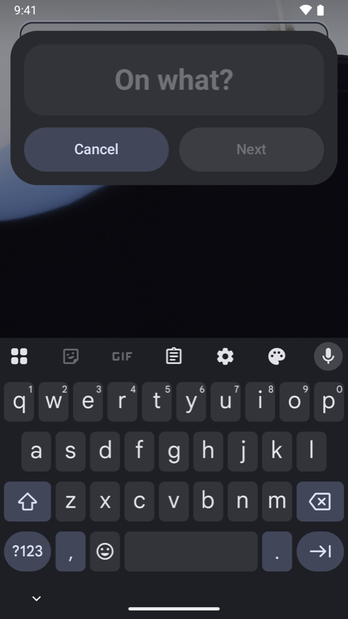
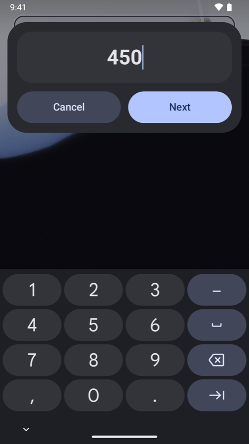
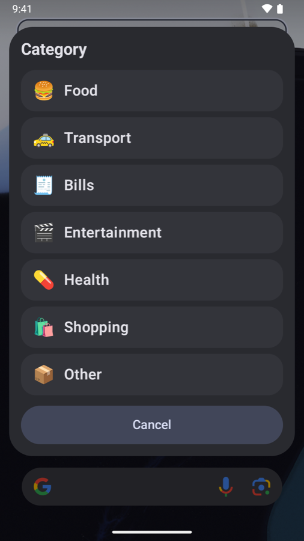
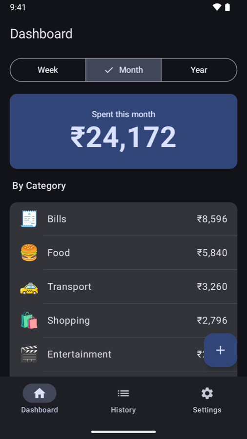
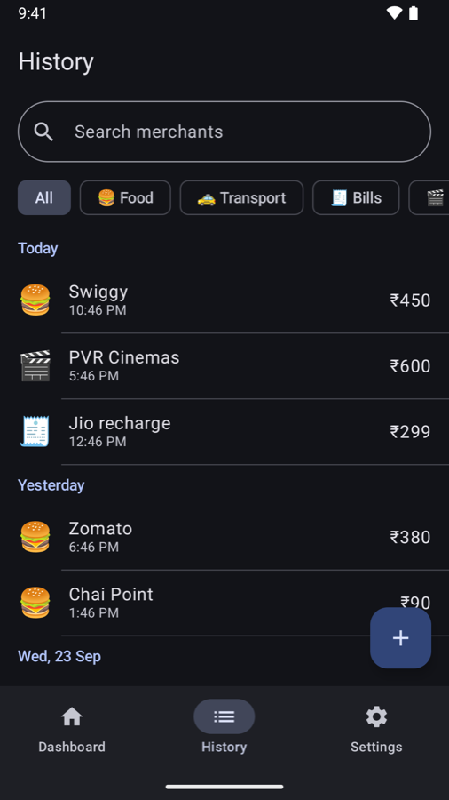
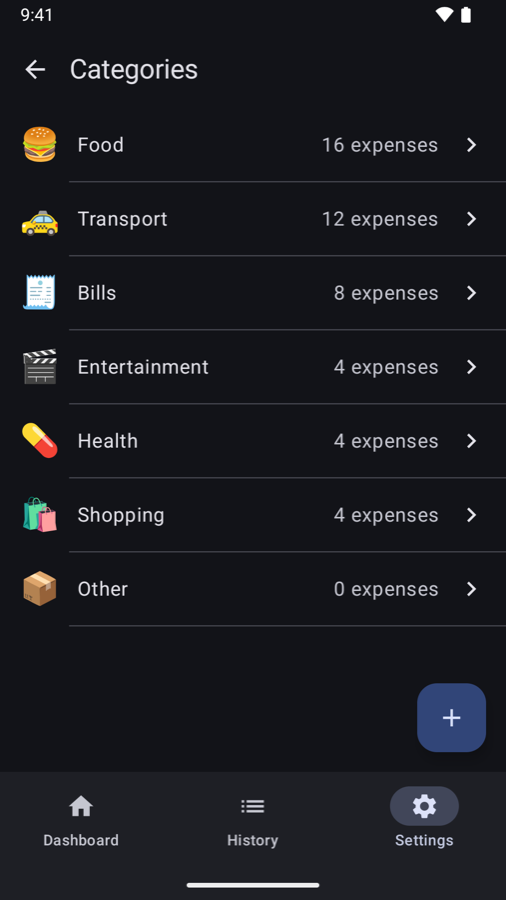
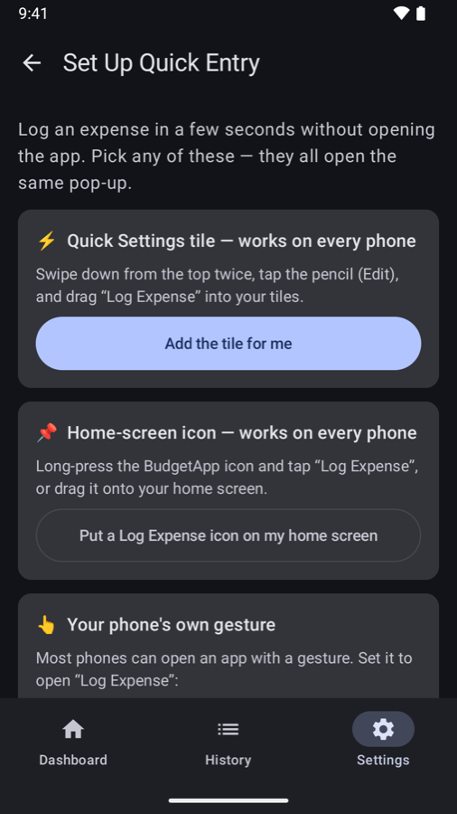

<p align="center">
  
</p>

<h1 align="center">BudgetApp for Android</h1>

<p align="center">
  A personal expense tracker where logging a purchase takes about five seconds:<br>
  <b>tap a tile or use your phone's gesture → type what it was → type the amount → pick a category.</b> Done.
</p>

<p align="center">
  Kotlin · Jetpack Compose · Room · ViewModels · JUnit · Android 8.0+ · only Google's Jetpack libraries
</p>

<p align="center">
  
  
  
</p>

<p align="center">
  Also on iPhone, where a double-tap on the back of the phone does the same:
  <a href="https://github.com/Madhav0637/bughet-app-ios"><b>BudgetApp for iOS</b></a>.
</p>

## Why

Most expense trackers don't fail because they lack features. They fail because opening an app, finding the add button and filling in a form is just enough friction that people stop logging after a week.

BudgetApp puts entry one gesture away. No hardware gesture exists on every Android phone, and apps can't listen to the power button, so the quick-entry pop-up is reachable three ways:

- a **Quick Settings tile** (swipe down, tap "Log Expense"), which works on every phone
- a **home-screen shortcut** (long-press the app icon, or pin a "Log Expense" icon), which also works on every phone
- the phone's **own gesture**, such as Samsung's side-button double press or Pixel's Quick Tap, set to open the "Log Expense" entry

The pop-up is the app's own see-through window, drawn over whatever you're doing. It asks three questions and saves without ever opening the main app.

## Features

- **Quick entry.** "On what?" → amount (number pad) → category, most-used first. Saved silently. Both text steps use the same big, bold box.
- **Dashboard.** Switch between this week, month or year, and the choice is remembered. See the total, spending by category (highest first) and the latest expenses.
- **History.** Every expense, grouped by day ("Today", "Yesterday", "Mon, 21 Sep"). Search by merchant (ignores case and accents), filter by category with chips, swipe to delete with a 10-second **Undo**, tap to edit merchant, amount, category, date and time.
- **Categories.** Seven defaults, each with an emoji. Add your own, rename them, and move all of a category's expenses elsewhere. A category can't be deleted while it's in use or if it's the last one.
- **Export.** A **CSV** spreadsheet for Excel or Google Sheets, or an A4 **PDF** report with totals, a category breakdown and a paginated table of every expense, shared as a real file.
- **Set Up Quick Entry.** A guide in Settings with one-tap buttons to add the tile and pin a home-screen icon.
- **Private by design.** Everything stays on the phone. No account, no server, no network access.
- **Indian rupees**, with Indian digit grouping (₹1,23,456). Follows the phone's dark mode.

<p align="center">
  
  
  
  
</p>

## How quick entry works

```
Quick Settings tile ──────────┐
Long-press shortcut ──────────┼─▶ QuickEntryActivity (see-through window over the current app)
"Log Expense" launcher entry ─┘      ├─ "On what?"   big text box
  (brand gestures open this)         ├─ "Amount (₹)" same big box, number pad
                                     ├─ category list, most-used first
                                     └─▶ ExpenseService.add(...) → Room database on the phone
```

The pop-up has its own empty task affinity and is excluded from Recents, so saving or cancelling returns you straight to what you were doing. From the lock screen, the tile asks you to unlock first.

## Architecture

```
Tile / shortcut / gesture → quick-entry pop-up ──┐
                                                 ├──→ Services ──→ Room (on the phone)
Compose screens → ViewModels ────────────────────┘       │
Compose screens ◀── ViewModels ◀── Flow ─────────────────┘   (read-only, refreshes by itself)
```

- **Every write goes through a service** (`ExpenseService`, `CategoryService`), so the pop-up and the screens share one set of rules, for example "amount must be more than ₹0" and "category names are unique regardless of case". An invalid edit changes nothing.
- **Screens follow Android's standard pattern:** Room queries return `Flow`s, and ViewModels combine them into screen state, so lists update by themselves when the pop-up saves an expense.
- **The rules and calculations are plain Kotlin** with no Android code (`PeriodCalculator`, `SpendingSummary`, `HistoryFilter`, `CsvExporter`, `CategoryRules`, the PDF's `ReportContent`), so they're tested on the JVM in seconds.
- **Deleting a category that's in use is refused twice:** by the service, and by a `RESTRICT` foreign key in the database itself.
- **Default categories are seeded when the database file is created**, so the pop-up always has categories, even if the main app was never opened.

<details>
<summary><b>Project structure</b></summary>

```
app/src/main/java/com/madhav0637/budgetapp/
├── data/          # Room entities, DAOs, database (seeds the default categories)
├── domain/        # Services and plain-Kotlin rules: periods, summary, filter, CSV, report content
├── export/        # CSV/PDF file writer, PDF renderer
├── tile/          # Quick Settings tile
└── ui/            # quickentry (the pop-up), dashboard, history, settings, components
app/src/test/          # JVM tests for the domain layer
app/src/androidTest/   # On-device tests against an in-memory Room database
app/schemas/           # Room's record of the database layout, for future migrations
docs/SPEC.md           # Android spec and decision log
tools/                 # Script that draws the app icon's rupee layer
```
</details>

## Design decisions worth mentioning

- **A see-through pop-up, not a screen.** The iOS version relies on system prompts, which can't match fonts between steps. On Android the app draws the pop-up itself, so it floats over the current app *and* both text steps look the same.
- **A second "Log Expense" launcher entry.** Brand gesture settings can open an app but not a specific screen, so the pop-up is also its own launcher entry. The cost is a second icon in the app drawer.
- **Money is a whole number of rupees** (`Long`), never a floating-point type, so totals never pick up rounding errors. Saved times are rounded to milliseconds to match what Room stores.
- **Weeks always start on Monday**, whatever the phone's region setting. A period includes its first instant but not the next period's first.
- **Exports are written as real files and shared through a `FileProvider`**, so the share sheet keeps the `.csv` or `.pdf` name. Only the export folder can be shared.
- **The CSV escapes commas, quotes and line breaks**, and prefixes text starting with `=`, `+`, `-` or `@` with an apostrophe so spreadsheets don't run it as a formula (CSV injection).
- **Undo works on the same row.** A restored expense keeps its id, so the swipe state is reset after each delete. Otherwise the restored row would reappear already swiped away and be deleted again, a bug the testing caught.

## Testing

| Tests | Where they run |
|---|---|
| **46 JVM tests** for the domain layer | Your computer, no emulator needed |
| **18 on-device tests** for the services, database queries and real CSV/PDF files | An emulator or phone, against an in-memory Room database |

Dates are built in a fixed time zone (India Standard Time), so results are the same on any machine. Covered: validation and trimming; add, edit, delete and restore; default categories and most-used order; unique names and emoji checks; move-all and the delete rules; Monday-start weeks and period boundaries; totals and category order; search, filter and day grouping; CSV format and escaping; the PDF's contents and pagination.

```sh
./gradlew testDebugUnitTest            # JVM tests
./gradlew connectedDebugAndroidTest    # on-device tests, with an emulator or phone connected
```

Note: `connectedDebugAndroidTest` uninstalls the app when it finishes, which deletes any expenses on that device. To keep your data, install both APKs with `adb install -r` and run `adb shell am instrument -w com.madhav0637.budgetapp.test/androidx.test.runner.AndroidJUnitRunner` instead.

## Getting started

**Requirements:** Android Studio (2026.1 or newer), and a phone or emulator on Android 8.0 or newer. No developer account is needed.

1. Clone the repo and open the folder in Android Studio.
2. Pick an emulator or a connected phone (with USB debugging on) and press **Run ▶**.
3. In the app, open **Settings → Set Up Quick Entry** to add the tile or a home-screen icon, or to set up your phone's gesture.

### Building a signed APK to share

1. Create a signing key once (keep it and its password backed up, and never commit them):
   ```sh
   keytool -genkeypair -keystore ~/.android/budgetapp-release.jks -storetype PKCS12 \
     -alias budgetapp -keyalg RSA -keysize 4096 -validity 10000
   ```
2. Create `keystore.properties` in the repo folder (it's git-ignored):
   ```properties
   storeFile=/Users/<you>/.android/budgetapp-release.jks
   storePassword=<password>
   keyAlias=budgetapp
   keyPassword=<password>
   ```
3. Build it: `./gradlew assembleRelease`. The APK is at `app/build/outputs/apk/release/app-release.apk`, about 2 MB.
4. Before each update, increase `versionCode` (and `versionName`) in `app/build.gradle.kts`, and always sign with the same key. That's what lets an update install over the old version and keep its data.

To install it on a phone: open the APK, allow installing from that source when Android asks, and tap **Install**. Google Play Protect may warn about an app that isn't from the Play Store; **More details → Install anyway**.

## Not in scope (yet)

Income, budgets, recurring expenses, widgets, cloud sync (including with the iPhone app), charts and multiple currencies. These were left out on purpose to keep the first version focused on fast entry.

---

Built by **Madhav Agrawal** ([@Madhav0637](https://github.com/Madhav0637)) as a learning and portfolio project. Released under the [MIT License](LICENSE).
